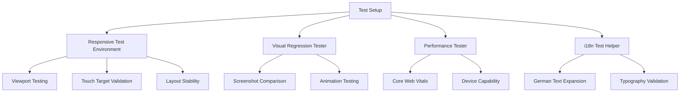

# Responsive Testing Infrastructure Documentation

This document provides comprehensive guidance on using the responsive testing infrastructure implemented for the portfolio website. The testing framework ensures components work correctly across all breakpoints, languages, and device capabilities while maintaining performance standards.

## Table of Contents

1. [Overview](#overview)
2. [Test Utilities](#test-utilities)
3. [Usage Examples](#usage-examples)
4. [Custom Matchers](#custom-matchers)
5. [Best Practices](#best-practices)
6. [Troubleshooting](#troubleshooting)

## Overview

The responsive testing infrastructure provides comprehensive testing capabilities for:

- **Responsive Layout Testing**: Viewport-based testing across standard breakpoints
- **Touch Target Validation**: Accessibility compliance for interactive elements
- **Visual Regression Testing**: Screenshot comparison and visual diff detection
- **German Language Layout Testing**: Internationalization and text expansion handling
- **Performance Testing**: Mobile optimizations and Core Web Vitals validation
- **Device Capability Testing**: Low-powered device and reduced motion support

### Architecture



## Test Utilities

### 1. Responsive Test Environment

The core utility for managing viewport dimensions and device characteristics.

```typescript
import { ResponsiveTestEnvironment, TEST_VIEWPORTS } from './utils/responsive-test-helpers';

const env = new ResponsiveTestEnvironment();

// Set viewport dimensions
env.setViewport('mobile'); // or 'tablet', 'desktop'
env.setViewport({ width: 1440, height: 900 }); // Custom dimensions

// Configure device characteristics
env.setTouchDevice(true); // Enable touch events
env.setPrefersReducedMotion(true); // Mock reduced motion preference

// Clean up after tests
env.cleanup();
```

**Available Viewports:**
- `mobile`: 375×667px (iPhone SE)
- `mobileLarge`: 414×896px (iPhone 11 Pro)  
- `tablet`: 768×1024px (iPad)
- `tabletLandscape`: 1024×768px (iPad Landscape)
- `desktop`: 1440×900px (Desktop)
- `desktopLarge`: 1920×1080px (Large Desktop)
- `ultrawide`: 2560×1440px (Ultrawide)

### 2. Layout Validation

```typescript
import {
  testAtViewports,
  validateTouchTargets,
  validateNoHorizontalScroll,
  validateLayoutStability,
  TOUCH_TARGET_SIZES,
} from './utils/responsive-test-helpers';

// Test component across multiple viewports
const results = await testAtViewports(
  <YourComponent />,
  ['mobile', 'tablet', 'desktop'],
  async (viewport) => {
    // Custom test logic for each viewport
    const { container } = render(<YourComponent />);
    expect(validateNoHorizontalScroll(container)).toBe(true);
  }
);

// Validate touch targets meet accessibility requirements
const { container } = render(<YourComponent />);
const touchValidation = validateTouchTargets(
  container,
  TOUCH_TARGET_SIZES.minimum // 44px minimum
);

expect(touchValidation.valid).toBe(true);
expect(touchValidation.violations).toHaveLength(0);

// Test layout stability across breakpoints
const stability = await validateLayoutStability(<YourComponent />);
expect(stability.stable).toBe(true);
```

### 3. Visual Regression Testing

```typescript
import {
  VisualRegressionTester,
  createVisualTestSuite,
} from './utils/visual-regression-helpers';

// Create test suite for a component
const visualSuite = createVisualTestSuite('hero-component');

// Test across all breakpoints
const results = await visualSuite.testAllBreakpoints(
  <HeroComponent />,
  { threshold: 0.1 } // 10% difference threshold
);

// Test specific viewport
const singleResult = await visualSuite.testViewport(
  <HeroComponent />,
  'mobile',
  { updateBaseline: false }
);

// Test animations
const animationResults = await visualSuite.testAnimations(
  <AnimatedComponent />,
  (element) => element.click() // Animation trigger
);

// Generate comprehensive report
const report = visualSuite.generateReport(results);
console.log(report.summary);

// Cleanup
visualSuite.cleanup();
```

### 4. German Language Testing

```typescript
import {
  testWithBothLanguages,
  validateTextExpansionHandling,
  validateGermanTypography,
  testWithGermanContent,
  GERMAN_LAYOUT_CONFIG,
} from './utils/i18n-responsive-helpers';

// Test component in both German and English
const languageResults = await testWithBothLanguages(
  <YourComponent />,
  async (language) => {
    // Test logic for each language
    const { container } = render(<YourComponent />);
    expect(container.querySelector('h1')).toBeTruthy();
  }
);

expect(languageResults.de).toBe(true);
expect(languageResults.en).toBe(true);

// Test German text expansion handling
const { container } = render(<GermanComponent />);
const expansionResult = validateTextExpansionHandling(
  container,
  GERMAN_LAYOUT_CONFIG.textExpansionFactor // 1.3x expansion
);

expect(expansionResult.valid).toBe(true);

// Validate German typography readability
const typography = validateGermanTypography(container);
expect(typography.score).toBeGreaterThan(80); // 80+ readability score

// Test with real German content
const contentResults = await testWithGermanContent(
  <YourComponent />,
  'longText', // Content type
  ['mobile', 'tablet', 'desktop']
);

expect(contentResults.overallScore).toBeGreaterThan(75);
```

### 5. Performance Testing

```typescript
import {
  WebVitalsTester,
  DeviceCapabilityTester,
  PERFORMANCE_BUDGETS,
} from './utils/performance-test-helpers';

const webVitalsTester = new WebVitalsTester();
const deviceTester = new DeviceCapabilityTester();

// Comprehensive performance test
const perfResults = await webVitalsTester.runFullPerformanceTest(
  <YourComponent />,
  'mobile',
  {
    testParticles: true,
    testImages: true,
    testMemory: true,
    iterations: 5,
  }
);

expect(perfResults.overallScore).toBeGreaterThan(80);
expect(perfResults.passed).toBe(true);

// Test particle optimization for mobile
const particleResults = await webVitalsTester.testParticleOptimization(
  <ParticleComponent />
);

const mobileResult = particleResults.find(r => r.viewport === 'mobile');
expect(mobileResult?.particleCount).toBeLessThanOrEqual(
  PERFORMANCE_BUDGETS.mobile.particleCount
);

// Test low-powered device adaptation
const lowPowerResult = await deviceTester.testLowPoweredDevicePerformance(
  <YourComponent />
);

expect(lowPowerResult.adaptedCorrectly).toBe(true);
expect(lowPowerResult.performanceImpact).toBeLessThan(50); // <50% impact

// Test reduced motion support
const reducedMotionResult = await deviceTester.testReducedMotionPerformance(
  <AnimatedComponent />
);

expect(reducedMotionResult.respectsPreference).toBe(true);
expect(reducedMotionResult.performanceImprovement).toBeGreaterThan(0);

// Cleanup
webVitalsTester.cleanup();
```

## Custom Matchers

The testing infrastructure extends Vitest with custom matchers for more expressive tests:

### Responsive Layout Matchers

```typescript
// Touch target validation
expect(container).toHaveValidTouchTargets(); // Default 44px minimum
expect(container).toHaveValidTouchTargets(48); // Custom minimum size

// Layout validation
expect(container).toHaveResponsiveLayout(); // No horizontal scroll
```

### Visual Testing Matchers

```typescript
// Visual regression
expect(visualDiff).toMatchVisualSnapshot(); // Default threshold
expect(visualDiff).toMatchVisualSnapshot(0.05); // 5% threshold

// Animation performance
expect(animationResults).toHaveGoodAnimationPerformance(); // Default 30fps
expect(animationResults).toHaveGoodAnimationPerformance(60); // 60fps minimum
```

### i18n Matchers

```typescript
// German text handling
expect(container).toHandleGermanTextExpansion(); // Default 1.5x factor
expect(container).toHandleGermanTextExpansion(1.3); // Custom factor

// Typography readability
expect(container).toHaveGoodGermanTypography(); // Default 80 score
expect(container).toHaveGoodGermanTypography(90); // Higher standard

// Multi-language support
await expect(component).toWorkInBothLanguages(testFn);
```

### Performance Matchers

```typescript
// Performance budgets
expect(perfResult).toMeetPerformanceBudget(); // Default 80 score
expect(perfResult).toMeetPerformanceBudget(90); // Higher standard

// Mobile optimization
expect(particleResults).toOptimizeForMobile();

// Reduced motion
expect(reducedMotionResult).toRespectReducedMotion();
```

## Usage Examples

### Basic Component Test

```typescript
import { describe, it, expect, beforeEach, afterEach } from 'vitest';
import { render } from '@testing-library/react';
import {
  ResponsiveTestEnvironment,
  testAtViewports,
  validateTouchTargets,
} from './utils/responsive-test-helpers';

describe('ResponsiveComponent', () => {
  let env: ResponsiveTestEnvironment;

  beforeEach(() => {
    env = new ResponsiveTestEnvironment();
  });

  afterEach(() => {
    env.cleanup();
  });

  it('should render correctly at all breakpoints', async () => {
    const results = await testAtViewports(
      <ResponsiveComponent />,
      ['mobile', 'tablet', 'desktop']
    );

    expect(results.every(r => r.success)).toBe(true);
  });

  it('should have proper touch targets on mobile', () => {
    env.setViewport('mobile');
    env.setTouchDevice(true);

    const { container } = render(<ResponsiveComponent />);
    expect(container).toHaveValidTouchTargets();
  });
});
```

### Comprehensive Component Test

```typescript
describe('ComplexResponsiveComponent', () => {
  it('should pass all responsive requirements', async () => {
    const component = <ComplexResponsiveComponent />;

    // Test layout across viewports
    const layoutResults = await testAtViewports(component);
    expect(layoutResults.every(r => r.success)).toBe(true);

    // Test visual consistency
    const visualSuite = createVisualTestSuite('complex-component');
    const visualResults = await visualSuite.testAllBreakpoints(component);
    const report = visualSuite.generateReport(visualResults);
    expect(report.passed).toBe(true);

    // Test German language support
    const i18nResults = await testWithGermanContent(component);
    expect(i18nResults.overallScore).toBeGreaterThan(80);

    // Test performance
    const webVitalsTester = new WebVitalsTester();
    const perfResult = await webVitalsTester.runFullPerformanceTest(
      component,
      'mobile'
    );
    expect(perfResult).toMeetPerformanceBudget();

    // Cleanup
    visualSuite.cleanup();
    webVitalsTester.cleanup();
  });
});
```

### Testing Particle Optimization

```typescript
describe('ParticleComponent', () => {
  it('should optimize particle count for mobile devices', async () => {
    const webVitalsTester = new WebVitalsTester();
    
    const results = await webVitalsTester.testParticleOptimization(
      <ParticleBackground />
    );

    expect(results).toOptimizeForMobile();
    
    const mobileResult = results.find(r => r.viewport === 'mobile');
    expect(mobileResult?.particleCount).toBeLessThanOrEqual(30);
    expect(mobileResult?.withinBudget).toBe(true);

    webVitalsTester.cleanup();
  });

  it('should respect reduced motion preferences', async () => {
    const deviceTester = new DeviceCapabilityTester();
    
    const result = await deviceTester.testReducedMotionPerformance(
      <ParticleBackground />
    );

    expect(result).toRespectReducedMotion();
    expect(result.performanceImprovement).toBeGreaterThan(20); // 20%+ improvement
  });
});
```

## Best Practices

### 1. Test Organization

- Group related responsive tests together
- Use descriptive test names that indicate viewport/scenario
- Clean up test environments in `afterEach` hooks
- Use consistent naming conventions

### 2. Viewport Testing Strategy

```typescript
// Test critical breakpoints for all components
const STANDARD_BREAKPOINTS = ['mobile', 'tablet', 'desktop'];

// Test additional breakpoints for layout-critical components
const EXTENDED_BREAKPOINTS = [
  'mobile', 'mobileLarge', 'tablet', 'tabletLandscape', 
  'desktop', 'desktopLarge'
];

// Focus on mobile-first testing
const MOBILE_FOCUSED = ['mobile', 'desktop']; // Minimum viable testing
```

### 3. Performance Testing Guidelines

- Test performance on mobile devices primarily
- Set realistic performance budgets
- Test with reduced motion enabled
- Validate particle optimization
- Check memory usage for complex components

### 4. Visual Regression Best Practices

- Update baselines intentionally, not automatically
- Use appropriate difference thresholds (5-10%)
- Test critical user journeys visually
- Capture screenshots at key interaction points

### 5. German Language Testing

- Test with realistic German content lengths
- Validate typography readability scores >80
- Check text expansion handling up to 1.5x
- Test at mobile breakpoints where space is limited

## Troubleshooting

### Common Issues

#### 1. Tests Failing Due to Timing

```typescript
// Use waitFor for async operations
await waitFor(() => {
  expect(container.querySelector('[data-loaded="true"]')).toBeTruthy();
});

// Add delays for animations
await new Promise(resolve => setTimeout(resolve, 100));
```

#### 2. Touch Target Validation False Positives

```typescript
// Exclude non-interactive elements
const touchValidation = validateTouchTargets(
  container,
  44,
  '[role="presentation"], .decorative' // Exclusion selector
);
```

#### 3. Visual Regression Test Flakiness

```typescript
// Use higher thresholds for components with animations
const results = await visualSuite.testAllBreakpoints(
  component,
  { threshold: 0.2 } // 20% for animated components
);

// Wait for animations to complete
await visualSuite.testViewport(
  component,
  'mobile',
  {
    waitFor: async () => {
      await new Promise(resolve => setTimeout(resolve, 1000));
    }
  }
);
```

#### 4. Performance Test Instability

```typescript
// Use multiple iterations for stable results
const perfResult = await webVitalsTester.measureRenderPerformance(
  component,
  'mobile',
  10 // 10 iterations for stable average
);

// Set realistic budgets for CI environment
const ciPerformanceBudgets = {
  ...PERFORMANCE_BUDGETS,
  mobile: {
    ...PERFORMANCE_BUDGETS.mobile,
    renderTime: PERFORMANCE_BUDGETS.mobile.renderTime * 1.5, // 50% more lenient
  },
};
```

### Debug Utilities

```typescript
// Enable debug mode for detailed output
process.env.DEBUG_RESPONSIVE_TESTS = 'true';

// Log viewport information
const env = new ResponsiveTestEnvironment();
env.setViewport('mobile');
console.log(`Current viewport: ${window.innerWidth}×${window.innerHeight}`);

// Capture debug screenshots
const visualTester = new VisualRegressionTester();
const screenshot = await visualTester.takeScreenshot(
  component,
  'debug-screenshot',
  'mobile'
);
```

## Configuration

### Custom Breakpoints

```typescript
// Define custom breakpoints in your test
const CUSTOM_VIEWPORTS = {
  ...TEST_VIEWPORTS,
  smallMobile: { width: 320, height: 568, name: 'iPhone 5' },
  largeDesktop: { width: 3440, height: 1440, name: 'Ultrawide 34"' },
};
```

### Performance Budget Customization

```typescript
const CUSTOM_BUDGETS = {
  ...PERFORMANCE_BUDGETS,
  mobile: {
    ...PERFORMANCE_BUDGETS.mobile,
    particleCount: 20, // More strict particle limit
    renderTime: 150,   // Faster render requirement
  },
};
```

### Visual Testing Configuration

```typescript
const VISUAL_CONFIG = {
  screenshotDir: '__tests__/screenshots',
  baselineDir: '__tests__/baselines',
  threshold: 0.05, // 5% default threshold
  pixelThreshold: 50, // Maximum 50 different pixels
};
```

This comprehensive testing infrastructure ensures that all responsive design implementations meet the highest standards for usability, performance, and accessibility across all devices and languages.